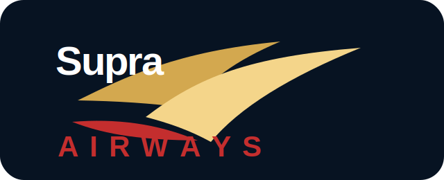
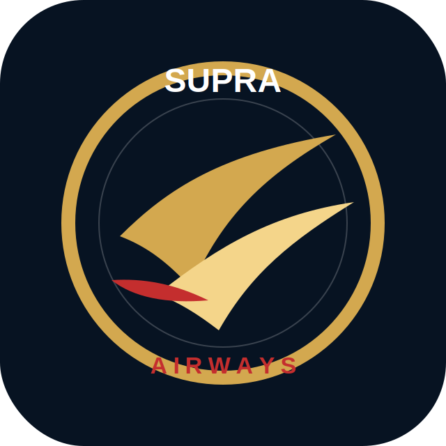
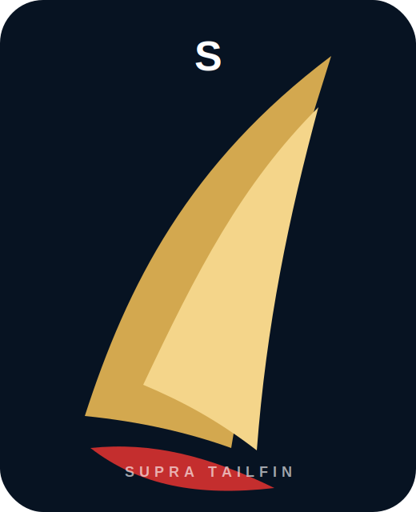

# PT Supra Airways Tbk

React landing page untuk brand fiktif **PT Supra Airways Tbk** dengan konsep maskapai premium: navy, gold, red accent, executive aviation, dan tagline **Legendaris di Udara**.

## Logo Options

### 1. Wingmark Classic


Logo utama untuk corporate signage, hero section, dokumen resmi, dan header website.

### 2. Skyline Emblem


Logo emblem untuk favicon, patch seragam, aplikasi mobile, dan brand mark kecil.

### 3. Supra Wordmark


Wordmark lebar untuk banner, billboard, company profile, dan livery pesawat.

### 4. Tailfin Mark


Ikon tailfin untuk ekor pesawat, boarding pass, merchandise, dan elemen grafis brand.

## Tech Stack

- React
- Vite
- CSS custom tanpa framework
- SVG logo assets di folder `public/logos`

## Development

```bash
npm install
npm run dev
```

## Build

```bash
npm run build
```

## Deploy Vercel

Project ini sudah siap untuk Vercel.

- Framework Preset: `Vite`
- Install Command: `npm install`
- Build Command: `npm run build`
- Output Directory: `dist`

Kalau repo sudah dihubungkan ke Vercel, setiap push ke branch `main` akan auto-deploy.
