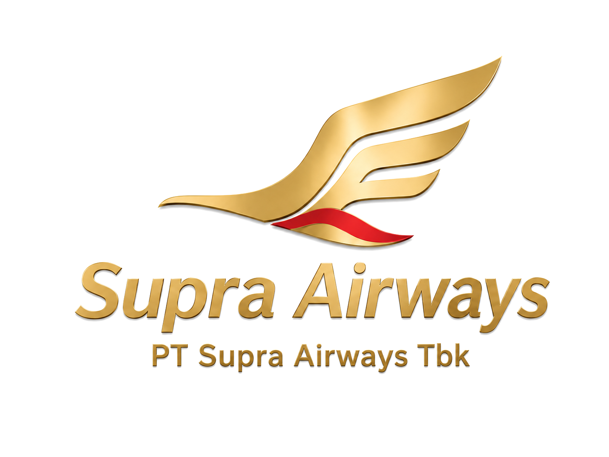

# PT Supra Airways Tbk

React landing page untuk brand fiktif **PT Supra Airways Tbk** dengan konsep maskapai premium: navy, gold, red accent, executive aviation, executive lounge, dan tagline **Redefining Premium Travel**.

## New Logo Assets

Logo lama berbasis SVG sudah diganti arahnya ke logo baru: **gold wing emblem** dengan **red accent**.

### Primary Logo / Label Version



Versi utama dengan icon + teks **Supra Airways** + **PT Supra Airways Tbk**. Dipakai untuk:

- hero section website
- brand identity section
- signage kantor / lounge
- company profile
- proposal investor
- deck presentasi

### Icon Only Version


Versi icon-only tanpa nama dan tanpa background putih. Dipakai untuk:

- favicon website
- navbar icon
- footer icon
- app icon
- social media avatar
- badge / patch seragam
- boarding pass dan tail mark

## Landing Page Content

Landing page sekarang diarahkan untuk menampilkan konteks lengkap **PT Supra Airways Tbk**:

- premium airline hero section
- logo brand dan icon-only
- executive lounge / reception visual
- boardroom direksi
- corporate frontdesk
- layanan premium lounge, boarding gate, dan flight information
- jajaran direksi perusahaan
- flight booking demo section

## Branding Folder Structure

Asset final PNG/WebP ditempatkan di:

```txt
public/branding/supra-logo-full.png
public/branding/supra-logo-icon.png
public/branding/showcase-lounge.png
public/branding/showcase-boardroom.png
public/branding/showcase-reception.png
public/branding/directors/komisaris.png
public/branding/directors/direktur-utama.png
public/branding/directors/cfio.png
public/branding/directors/direktur-pemasaran.png
public/branding/directors/direktur-relasi-bisnis.png
public/branding/directors/direktur-kesehatan-awak.png
```

## Tech Stack

- React
- Vite
- CSS custom tanpa framework
- PNG/WebP brand assets di folder `public/branding`

## Development

```bash
npm install
npm run dev
```

## Build

```bash
npm run build
```

## Deploy Vercel

Project ini sudah siap untuk Vercel.

- Framework Preset: `Vite`
- Install Command: `npm install`
- Build Command: `npm run build`
- Output Directory: `dist`

Kalau repo sudah dihubungkan ke Vercel, setiap push ke branch `main` akan auto-deploy.
